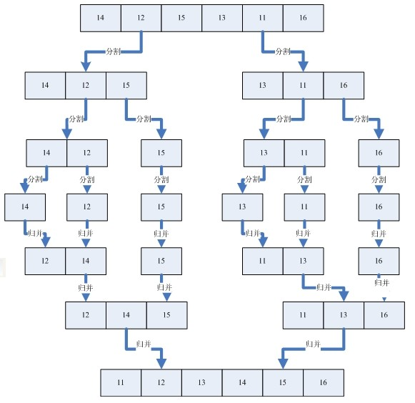

# 算法

## 排序

### 冒泡排序


```java
public class BubbleSort implements ISort {

    @Override
    public int[] sort(int[] array) {
        int size = array.length;
        for (int i = 0; i < size - 1; i++) {
            for (int j = 0; j < size - 1 - i; j++) {
                if (array[j] > array[j + 1]) {
                    swap(array, j, j + 1);
                }
            }
        }
        return array;
    }
}
```


### 选择排序


```java
public class SelectionSort implements ISort {
    @Override
    public int[] sort(int[] array) {
        int size = array.length;
        for (int i = 0; i < size - 1; i++) {
            int minIndex = i;
            for (int j = i + 1; j < size; j++) {
                if (array[minIndex] > array[j]) {
                    minIndex = j;
                }
            }
            swap(array, i, minIndex);
        }
        return array;
    }
}
```


### 插入排序


```java
public class InsertionSort implements ISort {
    @Override
    public int[] sort(int[] array) {
        int size = array.length;
        for (int i = 1; i < size; i++) {
            int current = array[i];
            int preIndex = i - 1;
            while (preIndex >= 0 && array[preIndex] > current) {
                array[preIndex + 1] = array[preIndex];
                preIndex--;
            }
            array[preIndex + 1] = current;
        }
        return array;
    }
}
```


### 希尔排序


```java
public class ShellSort implements ISort {
    @Override
    public int[] sort(int[] array) {
        int size = array.length;
        for (int interval = size / 2; interval > 0; interval/=2) {
            for (int i = interval; i < size; i++) {
                int j = i;
                int current = array[i];
                while (j >= interval && array[j - interval] > current) {
                    array[j] = array[j - interval];
                    j -= interval;
                }
                array[j] = current;
            }
        }
        return array;
    }
}
```


### 归并排序




```java
public class MergeSort implements ISort {
    @Override
    public int[] sort(int[] array) {
        return mergeSoft(array, 0, array.length - 1);
    }

    private int[] mergeSoft(int[] array, int left, int right) {
        int middle = (left + right) / 2;
        if (left < right) {
            // 先分别排序左右两边
            mergeSoft(array, left, middle);
            mergeSoft(array, middle + 1, right);
            // 归并
            merge(array, left, middle, right);
        }
        return array;
    }

    private void merge(int[] array, int left, int middle, int right) {
        int[] tempArray = new int[right - left + 1];
        int i = left;
        int j = middle + 1;
        int k = 0;

        // 把较小的数先移到新数组中
        while (i <= middle && j <= right) {
            if (array[i] > array[j]) {
                tempArray[k++] = array[j++];
            } else {
                tempArray[k++] = array[i++];
            }
        }

        // 把左边剩余的数移入数组
        while (i <= middle) {
            tempArray[k++] = array[i++];
        }

        // 把右边边剩余的数移入数组
        while (j <= right) {
            tempArray[k++] = array[j++];
        }

        // 把新数组中的数覆盖array数组
        for (int l = 0; l < tempArray.length; l++) {
            array[left + l] = tempArray[l];
        }
    }
}
```


### 快速排序


```java
public class QuickSort implements ISort {
    @Override
    public int[] sort(int[] array) {
        quickSort(array, 0, array.length - 1);
        return array;
    }

    private void quickSort(int[] array, int left, int right) {
        if (left >= right) {
            return;
        }
        int pivot = array[left];
        int i = left;
        int j = right;
        while (i < j) {
            // j向左移，直到遇到比key小的值
            while (i < j && pivot <= array[j]) {
                j--;
            }
            // i向右移，直到遇到比key大的值
            while (i < j && array[i] <= pivot) {
                i++;
            }
            // 如果此时 i<j, 就表示 array[i] > pivot > array[j],
            // 这时需要交换i和j指向的元素
            if (i < j) {
                swap(array, i, j);
            }
        }
        // left 和 i 指向的元素交换
        swap(array, left, i);
        quickSort(array, left, i - 1);
        quickSort(array, i + 1, right);
    }
}
```


### 堆排序


```java
public class HeapSort implements ISort {

    private int mSize;

    @Override
    public int[] sort(int[] array) {
        mSize = array.length;
        buildMaxHeap(array);

        // 因为R[1]为最大值，将堆顶元素R[1]与最后一个元素R[n]交换，
        // 此时得到新的无序区(R1,R2,……Rn-1)和新的有序区(Rn),
        // 且满足R[1,2…n-1]<=R[n]；
        for (int i = array.length - 1; i > 0; i--) {
            swap(array, 0, i);
            mSize--;
            heapify(array, 0);
        }
        return array;
    }

    /**
     * 将初始待排序关键字序列(R1,R2….Rn)构建成大顶堆，
     * 此堆为初始的无序区，且R1为最大值
     * @param array
     */
    private void buildMaxHeap(int[] array) {
        for (int i = mSize / 2; i >= 0 ; i--) {
            heapify(array, i);
        }
    }

    private void heapify(int[] array, int i) {
        int max = i;
        int left = 2*i+1;
        int right = 2*i+2;

        if (left < mSize && array[left] > array[max]) {
            max = left;
        }
        if (right < mSize && array[right] > array[max]) {
            max = right;
        }

        if (max != i) {
            swap(array, i, max);
            heapify(array, max);
        }
    }
}
```


### 计数排序


```java
public class CountingSort implements ISort {
    @Override
    public int[] sort(int[] array) {
        // 确定数组array的值的范围
        int min = array[0];
        int max = array[0];
        for (int i = 1; i < array.length; i++) {
            if (array[i] < min) {
                min = array[i];
            }
            if (array[i] > max) {
                max = array[i];
            }
        }
        // 开始排序
        if (min != max) {
            sort(array, min, max);
        }
        return array;
    }

    private void sort(int[] array, int min, int max) {
        int[] bucket = new int[max - min + 2];

        for (int i = 0; i < array.length; i++) {
            bucket[array[i]]++;
        }

        int index = 0;
        for (int i = 0; i < bucket.length; i++) {
            while (bucket[i] > 0) {
                array[index++] = i;
                bucket[i]--;
            }
        }

    }
}
```


## 动态规划

### [零钱兑换](https://leetcode-cn.com/problems/coin-change/)

>给定不同面额的硬币 coins 和一个总金额 amount。编写一个函数来计算可以凑成总金额所需的最少的硬币个数。如果没有任何一种硬币组合能组成总金额，返回 -1。

```java
class Solution {
    public int coinChange(int[] coins, int amount) {
        // dp[i]:凑齐金额i的最少硬币数
        int[] dp = new int[amount + 1];
        for(int i = 1; i <= amount; i++) {
            dp[i] = amount + 1;
            for(int j = 0; j < coins.length; j++) {
                if(i >= coins[j]) {
                    dp[i] = Math.min(
                        dp[i],
                        dp[i - coins[j]] + 1
                    );
                }
            }
        }

        return (dp[amount] == amount + 1 ? -1 : dp[amount]);
    }
}
```


### 子数组的最大和 （剑指offer 42）

> 输入一个整型数组，数组中的一个或连续多个整数组成一个子数组。求所有子数组的和的最大值。

```java
class Solution {
    public int maxSubArray(int[] nums) {
        int n = nums.length;
        // 以num[i]结尾的子数组的最大和
        int[] dp = new int[n];
        dp[0] = nums[0];
        for(int i = 1; i < n; i++) {
            dp[i] = Math.max(nums[i], dp[i-1] + nums[i]);
        }

        int max = dp[0];
        for(int i = 1; i < n; i++) {
            max = Math.max(max, dp[i]);
        }
        return max;
    }
}
```


### [最长递增子序列](https://leetcode-cn.com/problems/longest-increasing-subsequence/)

> 给你一个整数数组 nums ，找到其中最长严格递增子序列的长度。
>
> 子序列是由数组派生而来的序列，删除（或不删除）数组中的元素而不改变其余元素的顺序。例如，[3,6,2,7] 是数组 [0,3,1,6,2,2,7] 的子序列。

```java
class Solution {
    public int lengthOfLIS(int[] nums) {
        int n = nums.length;
        // 以nums[i]结尾的子序列的最大长度，初始都为1
        int[] dp = new int[n];
        for(int i = 0; i < n; i++) {
            dp[i] = 1;
        }

        // 遍历穷举
        for(int i = 1; i < n; i++) {
            for(int j = i-1; j >= 0; j--) {
                if(nums[i] > nums[j]) {
                    dp[i] = Math.max(dp[i], dp[j] + 1);
                }
            }
        }

        // 获取最大值
        int max = dp[0];
        for(int i = 0; i < n; i++) {
            max = Math.max(max, dp[i]);
        }
        return max;
    }
}
```


### [俄罗斯套娃信封问题](https://leetcode-cn.com/problems/russian-doll-envelopes/)

> 给你一个二维整数数组 envelopes ，其中 envelopes[i] = [wi, hi] ，表示第 i 个信封的宽度和高度。
>
> 当另一个信封的宽度和高度都比这个信封大的时候，这个信封就可以放进另一个信封里，
>
> 如同俄罗斯套娃一样。请计算 最多能有多少个 信封能组成一组“俄罗斯套娃”信封（即可以把一个信封放到另一个信封里面）。

```java
class Solution {
    public int maxEnvelopes(int[][] envelopes) {
        // 先对二维数组按照宽度进行排序
        Arrays.sort(envelopes, new Comparator<int[]>(){
            public int compare(int[] a, int[] b) {
                // 宽度相同时按照高度倒序排序，不相同时按照宽度顺序排序
                if(a[0] == b[0]) {
                    return b[1] - a[1];
                } else {
                    return a[0] - b[0];
                }
            }
        });

        // 获取高度数组
        int n = envelopes.length;
        int[] heightArrays = new int[n];
        for(int i = 0; i < n; i++) {
            heightArrays[i] = envelopes[i][1];
        }

        // 根据高度数组计算最大递增子序列长度，即为最大嵌套个数
        return lengthOfLIS(heightArrays);
    }
}
```

### [最长公共子序列](https://leetcode-cn.com/problems/longest-common-subsequence/)

> ```
> 输入：text1 = "abcde", text2 = "ace" 
> 输出：3  
> 解释：最长公共子序列是 "ace" ，它的长度为 3 。
> ```

```java
class Solution {
    public int longestCommonSubsequence(String text1, String text2) {
        int m = text1.length();
        int n = text2.length();
        // dp[i][j] : text1(0...i)和text2(0...j)的最长公共子序列
        //             " "    a    b    c    d    e
        //          j   0     1    2    3    4    5
        //        i --------------------------------
        // " "    0 |   0     0    0    0    0    0
        //  a     1 |   0
        //  c     2 |   0
        //  e     3 |   0                         ?
        int[][] dp = new int[m + 1][n + 1];
        for(int i = 1; i <= m; i++) {
            for(int j = 1; j <= n; j++) {
                if(text1.charAt(i - 1) == text2.charAt(j - 1)) {
                    dp[i][j] = dp[i - 1][j - 1] + 1;
                } else {
                    dp[i][j] = Math.max(dp[i - 1][j], dp[i][j - 1]);
                }
            }
        }
        return dp[m][n];
    }
}
```

### [ 编辑距离](https://leetcode-cn.com/problems/edit-distance/)

>将 `word1` 转换成 `word2` 所使用的最少操作数 。
>
>你可以对一个单词进行如下三种操作：插入一个字符、删除一个字符、替换一个字符
>
>输入：word1 = "horse", word2 = "ros"
>输出：3
>解释：
>horse -> rorse (将 'h' 替换为 'r')
>rorse -> rose (删除 'r')
>rose -> ros (删除 'e')

```java
class Solution {
    public int minDistance(String word1, String word2) {
        int l1 = word1.length();
        int l2 = word2.length();
        int[][] dp = new int[l1 + 1][l2 + 1];

        for(int i = 1; i <= l1; i++) {
            dp[i][0] = i;
        }
        for(int j = 1; j <= l2; j++) {
            dp[0][j] = j;
        }
        
        for(int i = 1; i <= l1; i++) {
            for(int j = 1; j <= l2; j++) {
                // dp[i][j] = -1;
                if(word1.charAt(i - 1) == word2.charAt(j - 1)) {
                    dp[i][j] = dp[i - 1][j - 1]; // 相等时跳过
                } else {
                    dp[i][j] = getMin(
                        dp[i][j - 1] + 1,        // 插入
                        dp[i - 1][j] + 1,        // 删除
                        dp[i - 1][j - 1] + 1     // 替换
                    );
                }
            }
        }
        return dp[l1][l2];
    }
}
```

```java
class Solution {
    public int minDistance(String word1, String word2) {
        int l1 = word1.length();
        int l2 = word2.length();
        int[][] dp = new int[l1 + 1][l2 + 1];
        for(int i = 0; i < l1; i++) {
            for(int j = 0; j < l2; j++) {
                dp[i][j] = -1;
            }
        }
        return dp(word1, word2, dp, l1 - 1, l2 - 1);
    }

    private int dp(String word1, String word2, int[][] dp, int i, int j) {
        // 其中一个字符串匹配完
        if(i < 0) {
            return j + 1;
        } else if(j < 0) {
            return i + 1;
        } 
        
        // 解决重叠子问题
        if(i < word1.length() && j < word2.length() && dp[i][j] >= 0) {
            return dp[i][j];
        } 

        if(word1.charAt(i) == word2.charAt(j)) {
            dp[i][j] = dp(word1, word2, dp, i - 1, j - 1); // 相等时跳过
        } else {
            dp[i][j] = getMin(
                dp(word1, word2, dp, i, j - 1)  + 1,       // 插入
                dp(word1, word2, dp, i - 1, j - 1)  + 1,   // 删除
                dp(word1, word2, dp, i - 1, j)  + 1,       // 替换
            );
        }
        return dp[i][j];
    }
}
```


### [最长回文子序列](https://leetcode-cn.com/problems/longest-palindromic-subsequence/)

> 给定一个字符串 `s` ，找到其中最长的回文子序列，并返回该序列的长度

```java
class Solution {
    public int longestPalindromeSubseq(String s) {
        int n = s.length();
        // dp[i][j]: s[i .. j]的最长回文子序列长度
        int[][] dp = new int[n][n];
        for(int i = 0; i < n; i++) {
            dp[i][i] = 1;
        }

        for(int i = n - 1; i >= 0; i--) {
            for(int j = i + 1; j < n; j++) {
                if(s.charAt(i) == s.charAt(j)) {
                    dp[i][j] = dp[i+1][j-1] + 2;
                } else {
                    dp[i][j] = Math.max(
                        dp[i+1][j],
                        dp[i][j-1]
                    );
                }
            }
        }
        return dp[0][n-1];
    }
}
```

### [让字符串成为回文串的最少插入次数](https://leetcode-cn.com/problems/minimum-insertion-steps-to-make-a-string-palindrome/)

> 给你一个字符串 s ，每一次操作你都可以在字符串的任意位置插入任意字符。
>
> 请你返回让 s 成为回文串的 最少操作次数 。
>
> 「回文串」是正读和反读都相同的字符串。

```java
class Solution {
    public int minInsertions(String s) {
        int n = s.length();
        // dp[i][j]: s[i .. j]的最小插入次数构造回文串
        int[][] dp = new int[n][n];
        
        for(int i = n - 2; i >= 0; i--) {
            for(int j = i + 1; j < n; j++) {
                if(s.charAt(i) == s.charAt(j)) {
                    dp[i][j] = dp[i + 1][j - 1];
                } else {
                    dp[i][j] = Math.min(dp[i+1][j], dp[i][j-1])+1;
                }
            }
        }
        return dp[0][n-1];
    }
}
```


### [ 正则表达式匹配](https://leetcode-cn.com/problems/zheng-ze-biao-da-shi-pi-pei-lcof/)

> 请实现一个函数用来匹配包含'. '和'*'的正则表达式。模式中的字符'.'表示任意一个字符，而'*'表示它前面的字符可以出现任意次（含0次）。在本题中，匹配是指字符串的所有字符匹配整个模式。
>
> 例如，字符串"aaa"与模式"a.a"和"ab*ac*a"匹配，但与"aa.a"和"ab*a"均不匹配。

```java
class Solution {
    public boolean isMatch(String s, String p) {
        int size_s = s.length();
        int size_p = p.length();

        boolean[][] dp = new boolean[size_s+1][size_p+1];
        dp[0][0] = true;

        for(int i = 0; i <= size_s; i++) {
            for(int j = 1; j <= size_p; j++) {
                if(p.charAt(j - 1) == '*') {
                    if(isMatch(s, i, p, j-1)) {
                        dp[i][j] = dp[i][j-2] | dp[i-1][j];
                    } else {
                        dp[i][j] = dp[i][j-2];
                    }
                } else {
                    if(isMatch(s, i, p, j)) {
                        dp[i][j] = dp[i-1][j-1];
                    }
                }
            }
        }
        return dp[size_s][size_p];
    }

    public boolean isMatch(String s, int i, String p, int j) {
        if(i == 0) {
            return false;
        }

        if(p.charAt(j - 1) == '.') {
            return true;
        }

        return s.charAt(i - 1) == p.charAt(j - 1);
    }
}
```


### 鸡蛋掉落 （leetcode 887）

>给你 k 枚相同的鸡蛋，并可以使用一栋从第 1 层到第 n 层共有 n 层楼的建筑。
>
>已知存在楼层 f ，满足 0 <= f <= n ，任何从 高于 f 的楼层落下的鸡蛋都会碎，从 f 楼层或比它低的楼层落下的鸡蛋都不会破。
>
>每次操作，你可以取一枚没有碎的鸡蛋并把它从任一楼层 x 扔下（满足 1 <= x <= n）。如果鸡蛋碎了，你就不能再次使用它。如果某枚鸡蛋扔下后没有摔碎，则可以在之后的操作中 重复使用 这枚鸡蛋。

```java
class Solution {
    public int superEggDrop(int k, int n) {
        // dp[i][j] : 对于i个鸡蛋、j个楼层的情况下，最小的扔鸡蛋次数
        int[][] dp = new int[k + 1][n + 1];

        // 例如3个鸡蛋（k = 3），4个楼层（n = 4）
        // dp  0    1    2    3    4
        //   |-----------------------
        // 0 | 0    0    0    0    0
        // 1 | 0    1    2    3    4
        // 2 | 0    1
        // 3 | 0    1              ?
        for(int i=0; i<=k; i++) {
            for(int j=0; j<=n; j++) {
                if(i == 0 || j == 0) {
                    dp[i][j] = 0;
                } else if(i == 1) {
                    dp[i][j] = j;
                } else if(j == 1) {
                    dp[i][j] = 1;
                } else {
                    dp[i][j] = n;
                }
            }
        }

        // 从 dp(2,2)开始遍历，最终得到dp(k,n)
        for(int i=2; i<=k; i++) {
            for(int j=2; j<=n; j++) {
                // 对于当前有 j 层的情况下，每一层都遍历一次
                for(int count=1; count <= j; count++) {
                    // 当前为count层，存在两种可能
                    // 1、鸡蛋破碎，那么鸡蛋i减1，限制层数为count减1
                    // 2、鸡蛋没碎，那么鸡蛋i不变，限制参数为j-count
                    // 最坏的情况，即取最大值
                    dp[i][j] = Math.min(
                        dp[i][j],
                        Math.max(
                            dp[i-1][count-1],
                            dp[i][j-count]
                        ) + 1
                    );
                }
            }
        }

        return dp[k][n];
    }
}
```


### [戳气球](https://leetcode-cn.com/problems/burst-balloons/)

> 有 n 个气球，编号为0 到 n - 1，每个气球上都标有一个数字，这些数字存在数组 nums 中。
>
> 现在要求你戳破所有的气球。戳破第 i 个气球，你可以获得 nums[i - 1] * nums[i] * nums[i + 1] 枚硬币。 这里的 i - 1 和 i + 1 代表和 i 相邻的两个气球的序号。如果 i - 1或 i + 1 超出了数组的边界，那么就当它是一个数字为 1 的气球。
>
> 求所能获得硬币的最大数量。

```java
class Solution {
    public int maxCoins(int[] nums) {
        int n = nums.length;

        // 给左右都添加 数字为1 的气球
        int[] points = new int[n + 2];
        points[0] = 1;
        points[n + 1] = 1;
        for(int i = 0; i < n; i++) {
            points[i + 1] = nums[i];
        }

        // dp[i][j] : 戳破 (i, j) 之间的气球得到的最多硬币
        int[][] dp = new int[n + 2][n + 2];

        // 对于 nums = [3,1,5,8]，且超出边界视为1
        //         1    3    1    5    8    1
        //         0    1    2    3    4    5
        //         --------------------------
        // 1  0  | 0    --------------->    ?
        // 3  1  |      0    --------------->
        // 1  2  |           0    ---------->
        // 5  3  |                0    ----->
        // 8  4  |                     0   ->
        // 1  5  |                          0

        // 设 k 表示i与j之间最后一个戳破的气球
        // 那么 dp[i][j] = dp[i][k] + dp[k][j] + points[i]*points[k]*points[j]
        for(int i = n; i >= 0; i--) {
            for(int j = i+1; j <= n+1; j++) {
                for(int k = i + 1; k < j; k++) {
                    dp[i][j] = Math.max(
                        dp[i][j],
                        dp[i][k] + dp[k][j] + points[i]*points[k]*points[j]
                    );
                }
            }
        }

        return dp[0][n+1];
    }
}
```


### 0-1背包问题

>给你一个可装载重量为W的背包和N个物品，每个物品有重量和价值两个属性。其中第i个物品的重量为wt[i]，价值为val[i]，求背包最多能装的价值

```java
class Solution {
    public int knapsack(int w, int n, int[] wt, int[] val) {
        // dp[i][j] : 对于前 i 个物品，背包容量为 j 的情况下，装的最高价值
        int[][] dp = new int[n + 1][w + 1];
        
        // base case : dp[0][...] = dp[...][0] = 0，表示什么都装不了
        //       0    1    2    3    4    5
        //       --------------------------
        //  0  | 0    0    0    0    0    0
        //  1  | 0    
        //  2  | 0         
        //  3  | 0                   
        //  4  | 0                        ？
        
        for(int i = 1; i <= n; i++) {
            for(int j = 1; i <= w; j++) {
                if(w < wt[i - 1]) {          // 装不下了
                    dp[i][j] = dp[i - 1][j];
                } else {
                    dp[i][j] = Math.max(
                	    dp[i-1][j],                     // 选择不装
                    	dp[i-1][w - wt[i-1]]+val[i-1]   // 选择装
                	);
                }
            }
        }
    }
}
```

